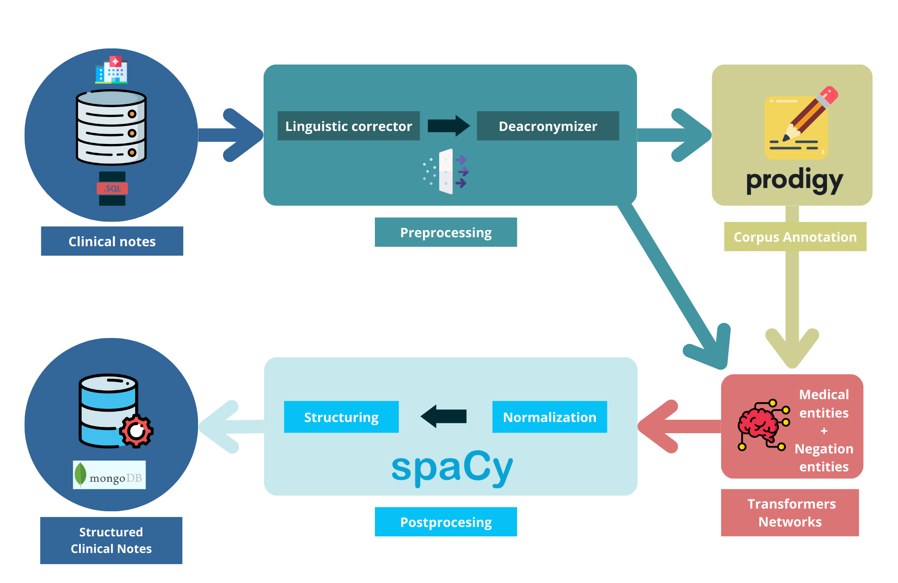

# NCP : NLP Cancer Pipeline

NCP: a module responsible for converting clinical judgments written in spanish natural language into a JSON format with the most important fields for analysis and data mining.




## Steps
### Preprocessing

Acronyms are only expanded if they are known [link](http://www.redsamid.net/archivos/201612/diccionario-de-siglas-medicas.pdf?0) and do not conflict with other words. The main objective is to correct spelling errors to improve network results.

### Annotation

This is done using the [Prodigy](https://prodi.gy/) tool from Explosion.

### Transformers Networks

NER models, fine-tuned from a pre-trained model.

Two models: 
- [Breast Cancer Diagnosis NER](https://huggingface.co/Alvaro8gb/es_BreastCancerNER)
- [Negation & Uncertainly](https://huggingface.co/Alvaro8gb/es_NegUncertaintyNER)

### Postprocessing: 

Two phases:

### Normalize

Definitive terms from the database.

---
### CMDS
## To test it

```python
python test.py
```

## Build package

	python setup.py sdist

## More

see Makefile [file](./Makefile)


## Citation
If you use our work in your research, please cite it as follows:

```bibtex
@INPROCEEDINGS{garcia-barraganCBMS2023,
  author={García-Barragán, Alvaro and Solarte-Pabón, Oswaldo and Nedostup, Georgiy and Provencio, Mariano and Menasalvas, Ernestina and Robles, Victor},
  booktitle={2023 IEEE 36th International Symposium on Computer-Based Medical Systems (CBMS)},
  title={Structuring Breast Cancer Spanish Electronic Health Records Using Deep Learning},
  year={2023},
  pages={404-409},
  keywords={Natural Language Processing (NLP), Information extraction, Deep Learning, Breast cancer.},
  doi={10.1109/CBMS58004.2023.00252}
}
```
